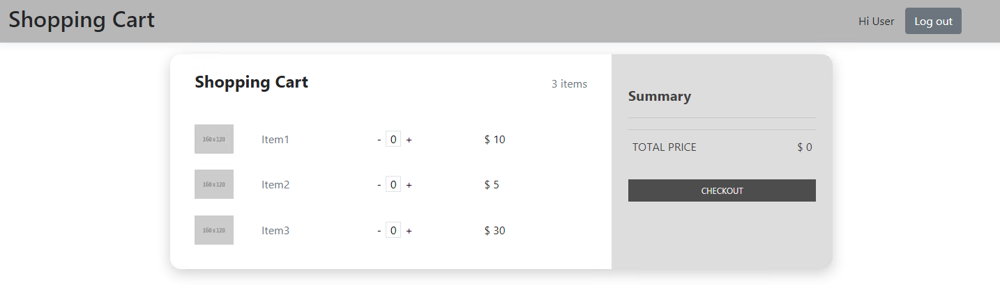

# 購物車

## 概述
以`net core 3.1`、`Angular`實作購物車功能。  
資料串接以`Dapper`連接`MS SQL`，後端資料結構主要是建立IRepository與Repository去處理核心邏輯  
前端做了基本的登入畫面，後端Controller以JWT Token做驗證，讓一般使用者無法取得管理員畫面的資料  
畫面如下：  
使用者登入畫面
  
一般使用者操作畫面
  
管理者查看訂單列表

## 前置作業
可執行`scripts`資料夾內的sql指令來建立table

## ToDo
1. 加入log與前後端錯誤處理
2. 調整欄位schema與呈現介面

